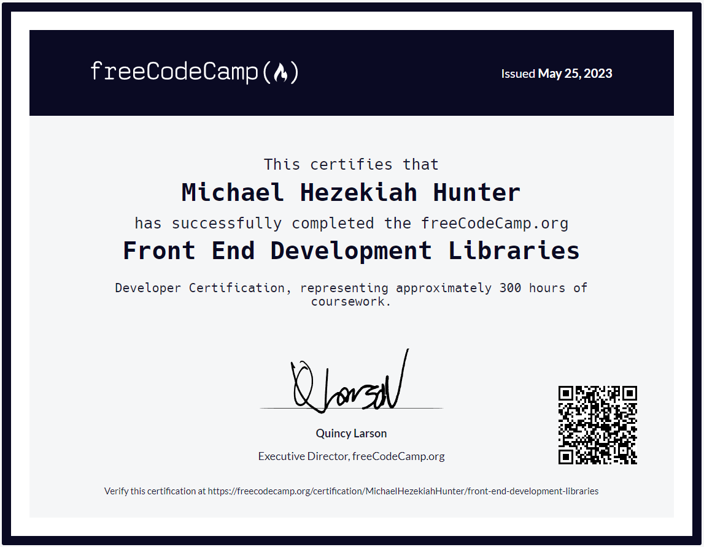

#List of projects and order completed:

_Note_: I initially started this course in 2022, but after gaining confidence I went on to start creating apps derived from my own ideas and interests. However, I wanted to finish what I started, so I came back to complete the rest of the projects. Very grateful for FCC.

## Project 1 - Random Quote App

Link: [Random Quote App](https://codepen.io/idioticbrilliance/pen/vYdoVqE)

## Project 2 - Markdown Previewer

Link: [Markdown Previewer](https://codepen.io/idioticbrilliance/pen/QWmLrrP)

## Project 3 - Drum Machine

Link: [Drum Machine](https://codepen.io/idioticbrilliance/pen/gOjgRdW)

## Project 4 - JavaScript Calculator

Link: [JavaScript Calculator](https://codepen.io/idioticbrilliance/pen/KKGZWZL?editors=0010)

## Project 5 - 25 + 5 Clock

Link: [25 + 5 Clock](https://codepen.io/idioticbrilliance/pen/oNadGZB?editors=0010)

